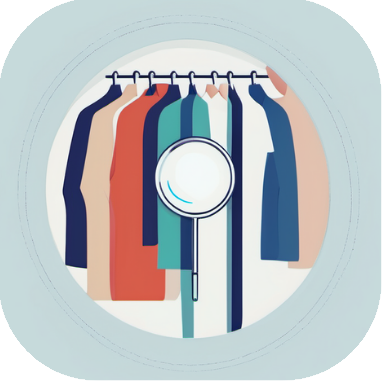

<p align="center">
     
</p>

# Fashion Atlas

This project aims to address the challenge of cross-matching clothes worn by individuals in real life to a database of images. To achieve this we created an application that snaps a picture of a person, segments the different articles of clothing, and matches it to the closest unique feature encoding in our predefined database. We were able to generate good matches by fine-tuning an object detection model and training an encoder network using triplet margin loss. With our selection of models optimized for inference speed and accuracy, our application achieves low latency response times and precise recommendations. The write-up for our code can be found here: [Fashion Atlas](https://drive.google.com/file/d/18KIJtBHPAO6X9lUBsgYLL8pWhv92UXd6/view?usp=drive_link).

## Setup

The installation instructions assume that you have [conda](https://conda.io/projects/conda/en/latest/user-guide/install/index.html) and [node](https://nodejs.org/en/download) installed.

1. Clone the repository: 
```bash
git clone https://github.com/troydutton/fashion-atlas.git
```

2. Create a conda environment with the required dependencies:
```bash
conda env create -f environment.yaml
conda activate fashion-atlas
```

3. Install the required frontend packages:
```bash
cd app/
npm install
cd ..
```

4. Download the pretrained weights for the object detection model and encoder network, placing the files in the ```models``` directory.

5. Download the datasets and extract them to the ```data``` directory:

 -  [DeepFashion2](https://github.com/switchablenorms/DeepFashion2) contains images of clothing items paired with corresponding bounding boxes and classes. We used these image-label pairs to fine-tune our object detection model. This dataset is only necessary if you want to fine-tune the object detection model yourself.
 -  [DressCode](https://github.com/aimagelab/dress-code) provides a comprehensive collection of model-garment image pairs. These garment images show the clothing item against a uniform background, while the model images show the same clothing item on a model. We use these images to generate anchor-positive pairs for training our encoder network. This dataset is required both to run the app backend and train the encoder network. 

6. Preprocess the DressCode dataset:
```bash
python encoder/preprocess.py
```

7. Compute the garment features:
```bash
python encoder/precompute.py
```

## Usage

These usage instructions require the [Expo Go App](https://expo.dev/go), or a device emulator like the one included in [Android Studio](https://developer.android.com/studio?gad_source=1&gclid=CjwKCAjw1K-zBhBIEiwAWeCOF6IOG2srwv2RPUv1AzfrqsnvWVdb4VZD5mZJ0IDRHkdrSQ7gIebDJRoCPB8QAvD_BwE&gclsrc=aw.ds).
1. In one terminal, start the app frontend:

 - Android Phone attached via USB with USB Debugging enabled (Preferred):
```bash
cd app/
npx expo start --localhost --android
```
 - Scan QR Code on Expo Go App (Android) or Camera App (iOS):
```bash
cd app/
npx expo start
```

2. In another terminal, start the server. ```<host>``` should be set to the IP address of the machine the server is running on. This can be found using ```ipconfig```, or can be set to ```0.0.0.0```, which allows the server to be accessible from any device on the network (Only use on private networks).
```
python server.py <host>
```

3. The app should now be open on your phone or emulator.

## Training

This section gives instructions on how to fine-tune the object detection model ([YOLOv8](https://github.com/ultralytics/ultralytics)) for clothing detection using the [DeepFashion2](https://github.com/switchablenorms/DeepFashion2) dataset, and how to train the encoder network yourself.

### Object Detection

1. Preprocess the dataset (Expects data to be in ```data/DeepFashion2/```):
```bash
conda activate fashion-atlas
python detection/preprocess.py
```

2. Configure the paths in ```config/DeepFashion2.yaml``` to point to the preprocessed dataset.

3. Start training:
```bash
python detection/train.py
```

### Encoder

Training losses and metrics are logged using [Weights & Biases](https://wandb.ai/site). You can login to your account using ```wandb login```, or only log locally using ```wandb offline```, or disable logging entirely using ```wandb disabled```. 

1. Train the encoder:
```bash
python encoder/train.py
```

# Authors

Created for Computer Vision (ECE379K) during the Spring 2024 Semester at the University of Texas at Austin.
- Haakon Mongstad
- Jasper Tan
- Varun Arumugam
- Troy Dutton